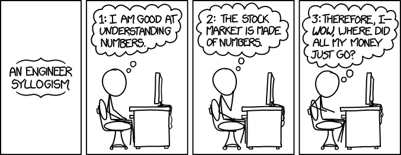

<h3 align="center">Stonks</h3>

<p align="center">
    <a href="https://www.youtube.com/watch?v=if-2M3K1tqk">
    </a>
    
</p>

<p align="center">
    <a href="https://stonks.bond">View Website</a>
</p>

## About The Project

Stonks is a robust Single Page Application (SPA) engineered to provide real-time insights and actions for stock and cryptocurrency enthusiasts. The platform amalgamates live stock news alongside trading functionalities to create a seamless and dynamic investment environment.

### Features

Stonks is rich with features designed to provide a comprehensive trading and investment platform:

- **Paper Trade:** Explore trading strategies with our intuitive watchlist builder and adept portfolio manager, without risking real capital.
- **Stocks Screener:** Discover momentum stocks with ease, filtering by relative strengths across different sectors and industries.
- **Crypto Token:** Seamlessly connect to your MetaMask wallet and enjoy the flexibility of transferring balances to our native cryptocurrency token, STON.
- **Earnings Calendar:** Stay ahead with our earnings calendar, tracking upcoming earnings releases from S&P 500 companies to make informed decisions.
- **Dashboard:** Effortlessly stay updated with the latest economic trends and market sentiment, encapsulated in a visually intuitive dashboard.

### Built With

- [![React][React.js]][React-url]
- [![Bootstrap][Bootstrap.com]][Bootstrap-url]
- [![Node.js][Node.js]][Node.js-url]
- [![Express][express]][express-url]
- [![PostgreSQL][PostgreSQL]][PostgreSQL-url]

## Usage

1. Start the backend server

```
cd backend
pnpm start
```

2. Start the frontend server

```
cd frontend
pnpm start
```

3. Navigate to http://localhost:3000/

<!-- MARKDOWN LINKS & IMAGES -->
<!-- https://www.markdownguide.org/basic-syntax/#reference-style-links -->

[React.js]: https://img.shields.io/badge/React-20232A?style=for-the-badge&logo=React&logoColor=61DAFB
[React-url]: https://reactjs.org/
[Bootstrap.com]: https://img.shields.io/badge/Bootstrap-563D7C?style=for-the-badge&logo=bootstrap&logoColor=white
[Bootstrap-url]: https://getbootstrap.com
[Node.js]: https://img.shields.io/badge/Node.js-20232A?style=for-the-badge&logo=node.js&logoColor=#339933
[Node.js-url]: https://nodejs.org/en/
[express]: https://img.shields.io/badge/express-DDDDDD?style=for-the-badge&logo=express&logoColor=%23000000
[express-url]: https://expressjs.com/
[PostgreSQL]: https://img.shields.io/badge/PostgreSQL-20232A?style=for-the-badge&logo=PostgreSQL&logoColor=%234169E1
[PostgreSQL-url]: https://www.postgresql.org/
